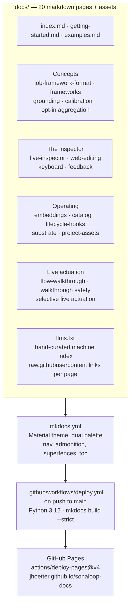

# Architecture

This repo is the **canonical, published home of Sonaloop's user-facing documentation**:
a lean [MkDocs Material](https://squidfunk.github.io/mkdocs-material/) site with no
build tooling beyond `mkdocs.yml` — no Makefile, no pyproject, no plugins except
search. Markdown in `docs/`, nav in `mkdocs.yml`, deployed automatically to GitHub
Pages at <https://jhoetter.github.io/sonaloop-docs/>.

## Site structure & publishing

- **Nav** is defined explicitly in `mkdocs.yml`: Home, Getting started, Example
  projects, then four sections — Concepts, The inspector, Operating, Live actuation.
- **`docs/llms.txt`** is a hand-maintained index for agents: a one-paragraph product
  summary plus raw-markdown URLs for every page, the core repo, and the persona
  database. Keep it in sync when adding or renaming pages; it ships in the built
  site as `/llms.txt`.
- **Publishing** is fully automated: `deploy.yml` triggers on push to `main` (or
  manual `workflow_dispatch`), installs `mkdocs-material`, runs
  `mkdocs build --strict`, and deploys the `site/` artifact. No `mkdocs gh-deploy`,
  no manual step. Local preview: `pip install mkdocs-material && mkdocs serve`.

## Where documentation lives across repos

Sonaloop documentation is split across three surfaces with a strict precedence rule
(see `README.md` here and `sonaloop/docs/README.md`):

| Surface | Location | Audience | Rule |
| --- | --- | --- | --- |
| Canonical user docs | **this repo** (`sonaloop-docs`) | Users and agents | New or changed product docs land here **first**; other surfaces follow |
| Deep agent docs | `sonaloop/docs/*.md` | Developers and coding agents | Only technical notes inseparable from code — contracts, protocols, seams, module paths; should link here rather than duplicate |
| In-app docs hub | `sonaloop/web/_docs_content.py` | In-product, bilingual de/en | Offline snapshot of the user-facing subset; when divergent, **sonaloop-docs wins** |

Core principle from the source repos: *"a feature isn't done until the surfaces are
updated."*

## Contributing a page

1. Add the markdown file under `docs/`.
2. Register it in the `nav:` section of `mkdocs.yml` (pages not in nav are orphaned —
   `--strict` builds will flag broken links).
3. Add its raw URL and one-line description to `docs/llms.txt`.
4. Push to `main`; the workflow builds and deploys within minutes.
